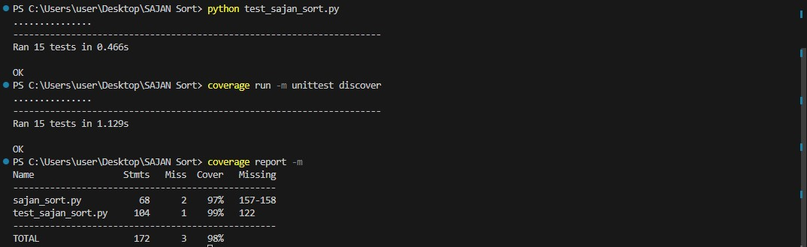

# SAJANSort

## Overview

SAJANSort is a dynamic sorting algorithm designed to handle both static datasets and real-time data streams. It adapts to new incoming data, making it suitable for applications where data is constantly being updated or received in real-time.

## Problem Statement

In many applications, data needs to be sorted dynamically as new data arrives. Traditional sorting algorithms may not be efficient when dealing with frequent updates or real-time data streams. SAJANSort addresses this problem by:

1. **Handling dynamic data updates**: Efficiently sorting new data as it arrives.
2. **Adapting to data patterns**: Using adaptive learning to optimize sorting strategies based on the patterns observed in the data.

## Features

- **Dynamic Adjustment**: Efficiently integrates new data into the existing sorted dataset.
- **Real-time Data Handling**: Capable of managing data streams and maintaining a sorted list.
- **Adaptive Learning**: Analyzes data patterns and adjusts the sorting strategy for optimal performance.

## Algorithms Used

SAJANSort leverages a combination of traditional sorting algorithms and adaptive learning techniques:

- **SortedList from `sortedcontainers`**: Provides a fast, memory-efficient way to maintain a sorted list.
- **Adaptive Learning**: Analyzes incoming data patterns to optimize sorting strategy dynamically.

## Installation

To get started with SAJANSort, clone the repository and install the required dependencies:

```sh
git clone https://github.com/54J4N/SAJANSort
cd SAJANSort
pip install -r requirements.txt

Usage
python
Copy code
from sajan_sort import SajanSort, generate_random_data

# Create an instance of SajanSort
sajan_sort = SajanSort()

# Input initial data
initial_data = generate_random_data(100, 0, 100)
sajan_sort.input_data(initial_data)

# Add new data dynamically
new_data = generate_random_data(50, 100, 150)
sajan_sort.dynamic_adjustment(new_data)

# Output sorted data
sorted_data = sajan_sort.output_data()
print(sorted_data)


Profiling
To profile the dynamic adjustment and real-time data handling methods, run the following commands:

python sajan_sort.py

Developer
Name: Sajan Ghimire

